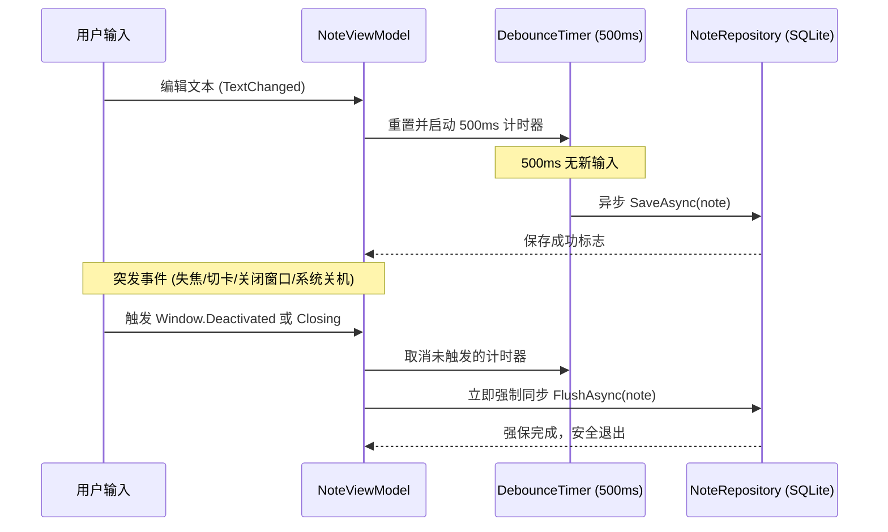
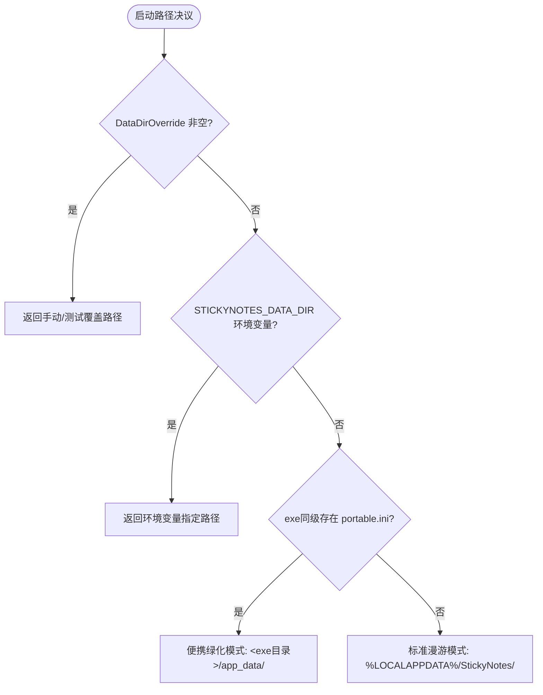

# StickyNotes 便签应用 —— 系统工程架构与技术方案

> **文档版本**：v1.0.0  
> **面向平台**：Windows 10 / Windows 11 (x64)  
> **工程定位**：高可靠、极简、高性能、可无缝扩展的 Windows 桌面便签系统架构。

---

## 1. 架构总览与核心设计原则

### 1.1 核心设计哲学
便签类工具属于“高频唤起、常驻后台、随手记录”的基础生产力工具。其技术架构的设计必须遵循以下最高原则：
1. **可靠性高于一切（Data Integrity First）**：用户写下的每一个字绝不能因软件崩溃、断电、闪退而丢失。
2. **轻量即美（Zero Bloatware）**：启动毫秒级、常驻内存数十兆、无运行时外部依赖、无复杂环境要求。
3. **行为确定且无黑盒（Determinism & Simplicity）**：排斥过度工程化和黑盒框架，关键路径（如跳行定位、数据库读写、状态同步）代码清晰可直观推导。
4. **易于维护与扩展（Extensible by Design）**：分层清晰、面向接口编程，未来平滑升级富文本、FTS5 全文搜索、多设备同步时无需推倒既有代码。

---

## 2. 关键技术选型对比与决策推导（对照 docs 三份原方案）

在 docs 目录下，此前已归档了三份不同视角的方案：
- 方案 A（`NET 的简易本地便签.md`）：主张 WPF + Dapper + 独立无边框贴纸窗口 + 原生 TextBox 跳行。
- 方案 B（`StickyNotes-项目方案.md`）：主张 .NET 8 LTS + WPF + EF Core + 内存搜索 + 单窗口左右分栏为主。
- 方案 C（`SimpleStickyNotes_项目方案.md`）：主张 .NET 10 + WPF + Microsoft.Data.Sqlite（坚决不用 EF Core）+ 严格数据防丢原则。

经过深度权衡与技术推导，本方案综合各方案优势，做出以下决定性技术决策：

### 2.1 决策一：UI 框架选择 —— WPF (.NET 8 LTS)
- **最终决策**：选择 **WPF** 基于 **.NET 8 LTS**（支持平滑构建于 .NET 10）。
- **对比与充足理由**：
  | 候选方案 | 优缺点对比 | 淘汰/采纳理由 |
  |:---|:---|:---|
  | **WPF (.NET 8)** | **优点**：成熟稳定已演进18年，纯原生 DirectX 渲染无闪烁，XAML 易于自定义无边框贴纸风格与调色盘；**最关键的是 `TextBox` 拥有最完整、底层的字符索引与视口滚动 API**（`ScrollToLine`, `GetRectFromCharacterIndex`, `Select`）。<br>**缺点**：跨平台能力弱（但本项目专注 Windows 10/11）。 | **【最终采纳】**<br>完全满足 Windows 10/11 平台需求，成熟无坑，关键的文本定位 API 原生健全。 |
  | **WinUI 3 / WASDK** | **优点**：现代 Fluent 视觉。<br>**缺点**：打包依赖 Windows App SDK 运行时，调试复杂，分发体积庞大，API 变动频繁，容易出现不可控底层 Crash。 | **【淘汰】**<br>破坏了“极简、可靠、无依赖”的核心原则。 |
  | **Electron / Tauri** | **优点**：Web 前端生态丰富。<br>**缺点**：内存占用起步 150MB~300MB，冷启动需数秒，多窗口独立贴纸时会开辟多个 Web 渲染进程，造成桌面极大资源浪费。 | **【淘汰】**<br>便签常驻桌面，资源消耗过重不可接受。 |
  | **WinForms** | **优点**：体积极小、纯 GDI。<br>**缺点**：现代样式定制极度痛苦，无边框圆角、主题切换、DPI 多屏缩放存在顽疾。 | **【淘汰】**<br>UI 表现力与现代便签体验脱节。 |

### 2.2 决策二：存储层与 ORM —— Microsoft.Data.Sqlite vs EF Core
- **最终决策**：采纳方案 C 的主张，**采用官方轻量级 `Microsoft.Data.Sqlite` + 纯参数化 SQL + `PRAGMA user_version` 增量迁移，坚决不引入 EF Core**。
- **充足理由**：
  1. **实体与模型极其简单**：便签系统本质只维护一张 `Notes` 表（仅 10 个左右字段）。EF Core 的 ChangeTracker、模型元数据编译、DbContext 上下文生命周期对于简单表是巨大的无谓开销。
  2. **冷启动加速与单文件瘦身**：不引入 EF Core 依赖可减少约 15MB 的打包体积，且冷启动省去模型编译时间（提升 200ms 以上）。
  3. **迁移完全透明**：EF Core 的 `__EFMigrationsHistory` 机制在桌面单机软件遇到意外断电或版本跨越时，容易报版本冲突异常；通过 SQLite 内置的 `PRAGMA user_version` 配合 C# 顺序脚本迁移，完全透明可控。

### 2.3 决策三：搜索机制与跳行定位架构
- **最终决策**：**SQLite 粗筛 (LIKE) + 内存绝对字符索引计算 + 视口居中动态滚动，持久化层严禁存储行号或字符偏移**。
- **充足理由**：
  1. **行号不能持久化到数据库**：用户在第一行插入一个回车，后面几千行的行号全部改变；因此行号与字符偏移只能是**运行时的瞬时计算结果**。
  2. **“字符偏移”才是唯一可靠锚点**：在开启 `TextWrapping="Wrap"`（自动换行）时，“逻辑行（换行符）”与“视觉折行”存在差异。只有基于文本的绝对字符偏移 `CharIndex` + `KeywordLength`，调用 `TextBox.Select()`，才是 100% 绝对精确的定位。
  3. **分阶段搜索策略**：v1 便签量通常在数百到千条内（纯文本总量一般小于 2MB），SQLite 内存或 LIKE 查询耗时小于 5ms，中文无需配置昂贵分词系统。定义 `ISearchService` 抽象接口，v2 数据规模超万条时可平滑升级为 SQLite FTS5（带 Trigram 分词器），上层 ViewModel 无需改动一行代码。

### 2.4 决策四：窗口与交互形态 —— 双核协同架构
- **最终决策**：打破方案 A 与 B 的局限，采用**双核协同架构（主管理窗口 + 独立浮动便签贴纸）**。
- **充足理由**：
  - 方案 B 的单窗口分栏虽然实现简单，但缺失了 OneNote / Sticky Notes 最精髓的“桌面随处贴”独立小贴纸体验。
  - 方案 A 的纯贴纸模式在便签多时难以高效检索与统筹管理。
  - **双核架构**：
    - `NotesListWindow`（管理中心）：负责便签全局卡片检索、置顶排序、新建与批量管理。
    - `NoteWindow`（独立贴纸）：轻量无边框，随处拖拽停靠，支持独立调色与置顶。
    - 两者基于 `CommunityToolkit.Mvvm` 的 `WeakReferenceMessenger` 进行松耦合消息广播，实现“主窗口修改即刻同步贴纸，贴纸保存即刻刷新列表”。

---

## 3. 总体系统分层架构设计

系统严格遵从分层清晰的 MVVM 架构：

```mermaid
graph TD
    subgraph UI_Layer [View 展现层 (WPF / XAML)]
        NLW[NotesListWindow 便签列表与搜索]
        NW[NoteWindow 独立便签贴纸]
        NB[TextBoxJumpBehavior 跳行行为扩展]
    end

    subgraph VM_Layer [ViewModel 业务表现层 (CommunityToolkit.Mvvm)]
        MVM[NotesListViewModel]
        NVM[NoteViewModel]
        SVM[SearchHitViewModel]
        MS[WeakReferenceMessenger 弱引用总线]
    end

    subgraph Service_Layer [Service 领域服务层]
        NS[NoteService 便签管理服务]
        SS[SearchService 搜索与坐标计算服务]
        AS[AutoSaveCoordinator 自动保存协调器]
        WM[WindowManager 窗口实例管理器]
    end

    subgraph Data_Layer [Data & Infrastructure 数据与基础设施层]
        NR[NoteRepository 仓储实现]
        DB[SqliteDatabaseContext SQLite连接与迁移]
        AP[AppPaths 跨平台路径管理]
        BK[BackupService 定时冷备份]
    end

    NLW --> MVM
    NW --> NVM
    NB -.-> NW

    MVM --> NS
    MVM --> SS
    MVM --> WM
    NVM --> NS
    NVM --> AS

    MVM <--> MS
    NVM <--> MS

    NS --> NR
    SS --> NR
    AS --> NR
    NR --> DB
    BK --> AP
    DB --> AP
```

### 3.1 职责边界划分（硬性隔离规范）
1. **View 层**：仅编写 XAML 布局与必须的 UI 交互（如窗口拖拽 `DragMove`、快捷键拦截、调用 `TextBox.Select()` 及视口滚动）。**严禁在 View 中直接调用 SQL 或 Repository**。
2. **ViewModel 层**：通过 `CommunityToolkit.Mvvm` 管理响应式数据，处理 Command 交互，调用 Service 层逻辑。不持有具体 UI 控件引用。
3. **Service 层**：承载业务规则（标题解析规则、字符坐标换算、防抖保存计时、窗口实例防重）。
4. **Data 层**：负责纯粹的 SQLite 数据持久化、WAL 事务控制、防注入参数化查询及增量迁移。

---

## 4. 核心技术难点攻克：搜索算法与精准跳行定位

“搜索文字跳转到对应文本行”是本项目的核心诉求。以下为经过严格论证的代码级完整工程解法。

### 4.1 核心数据结构与契约

```csharp
namespace StickyNotes.Models;

/// <summary>
/// 搜索命中项领域模型（纯内存计算，不持久化）
/// </summary>
public sealed record SearchHit(
    Guid NoteId,
    string NoteTitle,
    int LineNumber,        // 逻辑行号（从 1 开始，供 UI 呈现）
    int CharIndex,         // 命中起始字符在 Content 中的绝对位置（供跳转定位）
    int Length,            // 搜索关键字长度
    string LineSnippet,    // 命中行文本摘要（供列表预览）
    string HighlightText   // 实际命中的文字
);
```

### 4.2 搜索匹配与坐标解算算法 (`SearchService`)

```csharp
namespace StickyNotes.Services;

public interface ISearchService
{
    IReadOnlyList<SearchHit> Search(IEnumerable<Note> notes, string keyword);
}

public sealed class SearchService : ISearchService
{
    public IReadOnlyList<SearchHit> Search(IEnumerable<Note> notes, string keyword)
    {
        if (string.IsNullOrWhiteSpace(keyword))
            return Array.Empty<SearchHit>();

        var results = new List<SearchHit>();
        var trimmedKeyword = keyword.Trim();

        foreach (var note in notes.Where(n => !n.IsDeleted))
        {
            var content = note.Content;
            if (string.IsNullOrEmpty(content)) continue;

            var title = note.DisplayTitle;
            int searchStart = 0;

            // 循环遍历便签中所有命中位置（同一便签多处命中均可定位）
            while (searchStart < content.Length)
            {
                int matchIndex = content.IndexOf(trimmedKeyword, searchStart, StringComparison.OrdinalIgnoreCase);
                if (matchIndex < 0) break;

                // 1. 计算逻辑行号（统计前面换行符数量）
                int lineNumber = 1;
                for (int i = 0; i < matchIndex; i++)
                {
                    if (content[i] == '\n') lineNumber++;
                }

                // 2. 提取所在行的文本摘要
                int lineStart = content.LastIndexOf('\n', Math.Max(matchIndex - 1, 0));
                lineStart = (lineStart < 0) ? 0 : lineStart + 1;

                int lineEnd = content.IndexOf('\n', matchIndex);
                if (lineEnd < 0) lineEnd = content.Length;

                string lineText = content[lineStart..lineEnd].Trim('\r');

                results.Add(new SearchHit(
                    NoteId: note.Id,
                    NoteTitle: title,
                    LineNumber: lineNumber,
                    CharIndex: matchIndex,
                    Length: trimmedKeyword.Length,
                    LineSnippet: lineText,
                    HighlightText: content.Substring(matchIndex, trimmedKeyword.Length)
                ));

                // 推进指针，避免重叠或死循环
                searchStart = matchIndex + Math.Max(1, trimmedKeyword.Length);
            }
        }

        return results;
    }
}
```

### 4.3 UI 接收与精准高亮滚动实现 (`NoteWindow.xaml.cs`)

在 WPF 中，TextBox 动态载入文本后存在测量排版（Layout Measure）延迟。如果直接同步调用 `ScrollToLine`，极易因控件还未完成排版而导致滚动失效。必须调度至 `DispatcherPriority.Loaded` 之后执行。

```csharp
namespace StickyNotes.Views;

public partial class NoteWindow : Window
{
    public NoteWindow(NoteViewModel viewModel)
    {
        InitializeComponent();
        DataContext = viewModel;
    }

    /// <summary>
    /// 执行精准跳行与高亮定位
    /// </summary>
    public void JumpToSearchHit(int targetCharIndex, int keywordLength)
    {
        // 激活并前置窗口
        if (WindowState == WindowState.Minimized)
            WindowState = WindowState.Normal;
        
        Activate();
        Topmost = true; // 瞬时前置
        if (!((NoteViewModel)DataContext).IsPinned)
            Topmost = false; // 恢复原本置顶设置

        // 在布局计算完成后调度滚动
        Dispatcher.BeginInvoke(System.Windows.Threading.DispatcherPriority.Loaded, () =>
        {
            var text = EditorTextBox.Text;
            if (string.IsNullOrEmpty(text)) return;

            // 1. 安全防越界保护（防止在搜索后内容被编辑导致索引失效）
            int safeStart = Math.Clamp(targetCharIndex, 0, text.Length);
            int safeLen = Math.Clamp(keywordLength, 0, text.Length - safeStart);

            // 2. 聚焦并选中目标词（产生高亮选中底色）
            EditorTextBox.Focus();
            EditorTextBox.Select(safeStart, safeLen);

            // 3. 获得该字符对应的行索引（自动换行下的视觉行）
            int visualLineIndex = EditorTextBox.GetLineIndexFromCharacterIndex(safeStart);
            
            // 4. 精准居中滚动计算：使命中行处于视口垂直中央偏上，体验极佳
            try
            {
                var charRect = EditorTextBox.GetRectFromCharacterIndex(safeStart);
                double targetVerticalOffset = EditorTextBox.VerticalOffset + charRect.Top - (EditorTextBox.ActualHeight / 2.5);
                EditorTextBox.ScrollToVerticalOffset(Math.Max(0, targetVerticalOffset));
            }
            catch
            {
                // 兜底回退机制：调用原生 ScrollToLine
                EditorTextBox.ScrollToLine(visualLineIndex);
            }
        });
    }
}
```

### 4.4 编辑器 XAML 核心属性声明
```xml
<TextBox x:Name="EditorTextBox"
         Text="{Binding Content, UpdateSourceTrigger=PropertyChanged}"
         AcceptsReturn="True"
         AcceptsTab="True"
         TextWrapping="Wrap"
         VerticalScrollBarVisibility="Auto"
         HorizontalScrollBarVisibility="Disabled"
         IsInactiveSelectionHighlightEnabled="True"
         SelectionBrush="#0078D7"
         FontSize="14"
         FontFamily="Segoe UI, Microsoft YaHei"
         BorderThickness="0"
         Background="Transparent"
         Margin="12,8,12,12"/>
```
> **关键细节说明**：`IsInactiveSelectionHighlightEnabled="True"` 是 WPF 的关键特性。即使用户的鼠标或焦点又点回了主窗口的搜索框，便签文本框被选中的关键字依然维持明显的选中底色高亮，不会褪去。

---

## 5. 数据持久化与高可靠性架构

### 5.1 数据库模式与存储路径
- 数据库路径：`%LOCALAPPDATA%\StickyNotes\notes.db`
- 开启 WAL（Write-Ahead Logging）高并发与防损坏模式：
  ```sql
  PRAGMA journal_mode = WAL;
  PRAGMA synchronous = NORMAL;
  PRAGMA foreign_keys = ON;
  ```

### 5.2 数据库 Schema 与增量版本迁移机制 (`PRAGMA user_version`)

不需要笨重的 EF Core Migration，由底层的 `SqliteDatabaseContext` 自动执行增量迁移：

```sql
-- Schema Version 1 (MVP)
CREATE TABLE IF NOT EXISTS Notes (
    Id           TEXT PRIMARY KEY,
    Content      TEXT NOT NULL DEFAULT '',
    Color        TEXT NOT NULL DEFAULT 'Yellow',
    IsPinned     INTEGER NOT NULL DEFAULT 0,
    IsDeleted    INTEGER NOT NULL DEFAULT 0,
    WindowX      REAL NOT NULL DEFAULT 100,
    WindowY      REAL NOT NULL DEFAULT 100,
    WindowWidth  REAL NOT NULL DEFAULT 320,
    WindowHeight REAL NOT NULL DEFAULT 360,
    IsOpen       INTEGER NOT NULL DEFAULT 1,
    CreatedAt    TEXT NOT NULL,
    UpdatedAt    TEXT NOT NULL
);

CREATE INDEX IF NOT EXISTS IX_Notes_UpdatedAt ON Notes(UpdatedAt DESC);
CREATE INDEX IF NOT EXISTS IX_Notes_IsDeleted ON Notes(IsDeleted);
```

#### 迁移控制实现：
```csharp
public sealed class SqliteDatabaseContext
{
    private readonly string _connectionString;

    public SqliteDatabaseContext(string dbPath)
    {
        _connectionString = new SqliteConnectionStringBuilder
        {
            DataSource = dbPath,
            Mode = SqliteOpenMode.ReadWriteCreate,
            Cache = SqliteCacheMode.Shared
        }.ToString();
    }

    public async Task InitializeAndMigrateAsync()
    {
        await using var connection = new SqliteConnection(_connectionString);
        await connection.OpenAsync();

        // 启用 WAL 模式
        await using (var walCmd = connection.CreateCommand())
        {
            walCmd.CommandText = "PRAGMA journal_mode = WAL; PRAGMA synchronous = NORMAL;";
            await walCmd.ExecuteNonQueryAsync();
        }

        // 读取当前 Schema 版本
        int currentVersion = 0;
        await using (var verCmd = connection.CreateCommand())
        {
            verCmd.CommandText = "PRAGMA user_version;";
            var result = await verCmd.ExecuteScalarAsync();
            if (result != null) currentVersion = Convert.ToInt32(result);
        }

        // 执行增量更新
        if (currentVersion < 1)
        {
            await using var tx = connection.BeginTransaction();
            await using var migrateCmd = connection.CreateCommand();
            migrateCmd.Transaction = tx;
            migrateCmd.CommandText = """
                CREATE TABLE IF NOT EXISTS Notes (
                    Id           TEXT PRIMARY KEY,
                    Content      TEXT NOT NULL DEFAULT '',
                    Color        TEXT NOT NULL DEFAULT 'Yellow',
                    IsPinned     INTEGER NOT NULL DEFAULT 0,
                    IsDeleted    INTEGER NOT NULL DEFAULT 0,
                    WindowX      REAL NOT NULL DEFAULT 100,
                    WindowY      REAL NOT NULL DEFAULT 100,
                    WindowWidth  REAL NOT NULL DEFAULT 320,
                    WindowHeight REAL NOT NULL DEFAULT 360,
                    IsOpen       INTEGER NOT NULL DEFAULT 1,
                    CreatedAt    TEXT NOT NULL,
                    UpdatedAt    TEXT NOT NULL
                );
                PRAGMA user_version = 1;
                """;
            await migrateCmd.ExecuteNonQueryAsync();
            await tx.CommitAsync();
        }
    }
}
```

### 5.3 自动保存防抖与多保险 Flush 机制

为防止频繁写库造成 IO 震荡，同时杜绝丢数据，设计 `AutoSaveCoordinator`：



---

## 6. 多窗口协同与生命周期管理

### 6.1 `WindowManager` 窗口单例与调度中心
在 Windows Sticky Notes 中，每条便签对应一个独立的 `NoteWindow`。当用户在主管理窗口双击某便签，或从搜索列表点击跳转时，系统不能重复新建已打开的窗口。

```csharp
namespace StickyNotes.Services;

public sealed class WindowManager
{
    private readonly Dictionary<Guid, NoteWindow> _activeNoteWindows = new();
    private readonly IServiceProvider _serviceProvider;

    public WindowManager(IServiceProvider serviceProvider) => _serviceProvider = serviceProvider;

    public NoteWindow OpenOrActivateNote(Note note, Action<NoteWindow>? onLoaded = null)
    {
        if (_activeNoteWindows.TryGetValue(note.Id, out var existingWindow))
        {
            if (existingWindow.WindowState == WindowState.Minimized)
                existingWindow.WindowState = WindowState.Normal;
            existingWindow.Activate();
            onLoaded?.Invoke(existingWindow);
            return existingWindow;
        }

        // 实例化新的独立便签窗口
        var vm = _serviceProvider.GetRequiredService<NoteViewModel>();
        vm.Initialize(note);

        var newWindow = new NoteWindow(vm);
        
        // 恢复窗口上次的位置与尺寸
        newWindow.Left = note.WindowX;
        newWindow.Top = note.WindowY;
        newWindow.Width = note.WindowWidth;
        newWindow.Height = note.WindowHeight;

        newWindow.Closed += (s, e) =>
        {
            _activeNoteWindows.Remove(note.Id);
        };

        _activeNoteWindows[note.Id] = newWindow;
        newWindow.Show();
        onLoaded?.Invoke(newWindow);
        return newWindow;
    }
}
```

### 6.2 单实例互斥量（Single Instance Mutex）
防止用户双击快捷方式导致打开两个进程同时操作同一个 SQLite 文件。在 `App.xaml.cs` 中：
```csharp
private static Mutex? _appMutex;

protected override void OnStartup(StartupEventArgs e)
{
    const string mutexName = "Global\\StickyNotes_App_Instance_Mutex_mcxiaoke";
    _appMutex = new Mutex(true, mutexName, out bool isNewInstance);

    if (!isNewInstance)
    {
        // 向已存在的实例发送 Windows 消息唤起前台，并退出当前进程
        NativeMethods.BringExistingInstanceToFront();
        Shutdown();
        return;
    }

    base.OnStartup(e);
}
```

---

## 7. 详细工程代码结构与命名空间规范

本项目采用清晰扁平的标准 .NET 解决方案架构：

```text
c:\Home\Projects\StickyNotes\
├── StickyNotes.sln
├── src\
│   └── StickyNotes\
│       ├── StickyNotes.csproj             // 声明 net8.0-windows, UseWPF=true
│       ├── App.xaml / App.xaml.cs         // 全局入口、单实例控制、DI配置、未捕获异常处理
│       ├── Models\
│       │   ├── Note.cs                    // 便签领域实体
│       │   ├── NoteColor.cs               // 便签7色定义与高对比色映射
│       │   └── SearchHit.cs               // 搜索命中模型
│       ├── Data\
│       │   ├── SqliteDatabaseContext.cs   // 数据库连接初始化与 PRAGMA 迁移
│       │   ├── INoteRepository.cs         // 仓储抽象接口
│       │   └── NoteRepository.cs         // 原生 Microsoft.Data.Sqlite 高性能 CRUD
│       ├── Services\
│       │   ├── ISearchService.cs          // 搜索计算契约
│       │   ├── SearchService.cs           // 内存遍历与行号/字符索引算子
│       │   ├── WindowManager.cs           // 贴纸多窗口单例生命周期管理
│       │   ├── AutoSaveCoordinator.cs     // 防抖保存与强制 Flush 调度
│       │   └── BackupService.cs           // 每日冷备份轮转
│       ├── ViewModels\
│       │   ├── NotesListViewModel.cs      // 主列表与搜索框 VM
│       │   ├── NoteViewModel.cs           // 独立贴纸 VM
│       │   └── SearchHitViewModel.cs      // 搜索卡片 VM
│       ├── Views\
│       │   ├── NotesListWindow.xaml(.cs)  // 主便签列表管理中心
│       │   ├── NoteWindow.xaml(.cs)       // 独立彩色便签贴纸窗口
│       │   └── Controls\
│       │       └── ColorPickerPopup.xaml  // 颜色选择浮窗
│       └── Resources\
│           ├── Themes\
│           │   └── StickyColors.xaml      // 7色主题笔刷资源
│           └── Icons.xaml                 // 矢量图标字典
└── tests\
    └── StickyNotes.Tests\
        ├── StickyNotes.Tests.csproj
        ├── SearchServiceTests.cs          // 搜索与跳行定位算法单测（中文、空值、首尾行、折行）
        └── NoteRepositoryTests.cs         // 数据库增删改查与迁移单测
```

### 7.1 项目依赖项 (`StickyNotes.csproj`)

```xml
<Project Sdk="Microsoft.NET.Sdk">
  <PropertyGroup>
    <OutputType>WinExe</OutputType>
    <TargetFramework>net8.0-windows</TargetFramework>
    <Nullable>enable</Nullable>
    <ImplicitUsings>enable</ImplicitUsings>
    <UseWPF>true</UseWPF>
    <ApplicationIcon>Resources/App.ico</ApplicationIcon>
  </PropertyGroup>

  <ItemGroup>
    <!-- 仅引入两款官方推荐的核心轻量库，绝不滥用依赖 -->
    <PackageReference Include="CommunityToolkit.Mvvm" Version="8.3.2" />
    <PackageReference Include="Microsoft.Data.Sqlite" Version="8.0.10" />
    <PackageReference Include="Microsoft.Extensions.DependencyInjection" Version="8.0.1" />
  </ItemGroup>
</Project>
```

---

## 8. 自动化测试与质量保障体系

### 8.1 核心单测：`SearchServiceTests`（确保跳行定位万无一失）
利用 `xUnit` 对关键搜索定位逻辑进行完备单元测试：

```csharp
public class SearchServiceTests
{
    private readonly SearchService _searchService = new();

    [Fact]
    public void Search_ShouldReturnCorrectLineNumber_AndCharIndex()
    {
        // Arrange
        var content = "第一行内容\n第二行包含待测试关键词SQLite\n第三行结束";
        var note = new Note { Id = Guid.NewGuid(), Content = content };

        // Act
        var hits = _searchService.Search(new[] { note }, "SQLite");

        // Assert
        Assert.Single(hits);
        var hit = hits[0];
        Assert.Equal(2, hit.LineNumber); // 第2行
        Assert.Equal(content.IndexOf("SQLite"), hit.CharIndex);
        Assert.Equal(6, hit.Length);
        Assert.Contains("第二行包含待测试关键词SQLite", hit.LineSnippet);
    }

    [Fact]
    public void Search_CaseInsensitive_And_MultipleHitsInSameLine()
    {
        var content = "test Test TEST";
        var note = new Note { Id = Guid.NewGuid(), Content = content };

        var hits = _searchService.Search(new[] { note }, "test");

        Assert.Equal(3, hits.Count);
        Assert.All(hits, h => Assert.Equal(1, h.LineNumber));
    }
}
```

### 8.2 质量验收矩阵（Checklist）

| 编号 | 验收项 | 验收标准 |
|:---|:---|:---|
| **TC-01** | **长文本底部跳行** | 100 行长文本，搜索第 95 行关键字，点击后准确滚动到底部居中并高亮。 |
| **TC-02** | **自动换行（Wrap）不偏移** | 极长单行发生多次折行，搜索折行后半段词汇，高亮完全准确。 |
| **TC-03** | **防抖保存验证** | 连续快速敲字，500ms 后观察 SQLite 磁盘写入，数据库内容准确更新。 |
| **TC-04** | **进程强杀防丢字** | 敲字后等待 1 秒，通过任务管理器强杀进程，重新启动后便签完整还原。 |
| **TC-05** | **多便签窗口记忆** | 拖动 3 张便签到屏幕不同位置并改色，退出重开，3 张便签精确在原位打开。 |

---

## 9. 编译、发布与未来升级路线

### 9.1 自包含单文件发布（开箱即用，零依赖）
通过以下命令即可编译出独立单文件 exe，目标机无需事先安装 .NET 运行时：

```bash
dotnet publish src/StickyNotes/StickyNotes.csproj \
  -c Release \
  -r win-x64 \
  --self-contained true \
  -p:PublishSingleFile=true \
  -p:IncludeNativeLibrariesForSelfExtract=true \
  -o ./dist/StickyNotes-v1.0.0-win64
```

### 9.2 Costura.Fody 单文件 DLL 依赖集成内嵌

为消除发布产物中散落的托管依赖（`Wpf.Ui.dll`、`Microsoft.Data.Sqlite.dll`、`CommunityToolkit.Mvvm.dll`、`Microsoft.Extensions.DependencyInjection.dll`、`SQLitePCLRaw.*.dll` 等），项目引入 `Costura.Fody` 织入流水线：
- **构建织入**：配置 `FodyWeavers.xml`（`<Costura />`），在 MSBuild 生成期自动将所有外部托管程序集压缩嵌入到 `StickyNotes.dll` 内部资源中；
- **运行时动态载入**：利用 Costura 的 `AppDomain.AssemblyResolve` 挂钩机制，在模块初始化时由内存中直接按需解压加载，完全规避程序集版本冲突与部署遗漏；
- **产物体积极致优化**：框架依赖便携版的发布包体积由原本散装约 20MB 压缩至仅 **3.47 MB**，目录仅含主程序、SQLite 原生驱动与配置样例。

### 9.3 便携绿化模式与基准存储拓扑（对齐 CarroDesk 工业级规范）

`StickyNotes.Infrastructure.AppPaths` 实现了四级基准存储路径决议体系：



#### 全局拓扑全景
```text
<DataDirectory>/
├── notes.db            # [核心存储] SQLite 单库（WAL 模式）
├── settings.json       # [系统配置] 窗口字号、偏好设置
├── window.json         # [视口记忆] 主列表窗口尺寸与屏幕位置
├── backups/            # [自动备份] 循环滚动冷备份副本
└── logs/               # [运行日志] 诊断与异常崩溃记录
```

- **绿色解压升级**：便携模式下数据完全内聚于 `app_data/`，软件升级只需覆盖 exe 与驱动，绝不影响或误改便签数据。

### 9.4 未来路线演进方案（平滑扩展）
1. **全文检索升级（FTS5）**：
   - 当便签数量达到 10,000+ 条时，在 `SqliteDatabaseContext` 中添加 `PRAGMA user_version = 2` 迁移，建立 `Notes_Fts` 虚拟表。
   - 实现 `FtsSearchService : ISearchService`，利用 SQLite FTS5 对海量笔记进行候选初筛，再由原算法精算行号，UI 零修改。
2. **Markdown 支持**：
   - 抽象 `IEditor`，在纯文本 TextBox 与 Markdown 预览控件间平滑切换。
3. **备份与多端同步**：
   - 数据库已有 `Guid Id`、`UpdatedAt`、`IsDeleted` 标准同步字段，后续支持将 `notes.db` 加密打包为 `.zip` 同步至 WebDAV 或云盘。
