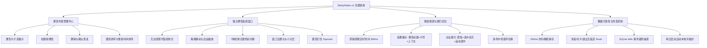

# StickyNotes 便签应用 —— 功能需求与产品设计说明书

> **文档版本**：v1.0.0  
> **面向平台**：Windows 10 / Windows 11 (x64)  
> **产品类型**：纯本地桌面轻量便利贴应用（致敬并增强 OneNote / Windows Sticky Notes）  
> **核心定位**：极简、极速、无广告、纯离线、支持**搜索文字精准跳转到对应行**的桌面便签工具。

---

## 1. 产品背景与设计目标

### 1.1 背景与用户痛点
在日常办公与开发过程中，微软官方的 OneNote Sticky Notes（便签）广受欢迎，但存在以下明显痛点：
1. **搜索定位能力弱**：官方便签只能搜到哪一张便签包含了关键词，但对于数千字的长便签，无法自动高亮并滚动定位到命中词所在的行，用户仍需人工翻找。
2. **强制联网与依赖登录**：经常因微软账号同步失败导致卡顿、打不开或数据丢失；
3. **部分系统不可用或被卸载**：在企业定制版 Windows（LTSC、精简版）中，微软应用商店及 Sticky Notes 默认被剔除，安装困难。

### 1.2 产品核心目标
本项目旨在打造一个**面向 Windows 10/11 的极简、可靠、无依赖的本地便签软件**：
- **还原经典体验**：具备类似 Windows Sticky Notes 的独立彩色便签浮动贴纸、桌面随处停靠、置顶钉住等核心体验。
- **攻克核心需求**：输入关键字后，毫秒级列出所有命中项（显示便签、行号、行内容摘要），**点击搜索结果立即唤起便签、精准选中关键词并自动滚动居中到对应文本行**。
- **可靠不丢数据**：纯本地单文件 SQLite 数据库持久化，输入防抖自动保存 + 强退 Flush 机制 + 每日定时轮转冷备份，确保“写下的每一个字绝不丢失”。
- **架构易扩展**：模块解耦分层清晰，未来可无缝平滑扩展富文本/Markdown、标签分类、SQLite FTS5 全文检索、跨设备备份导出等能力。

---

## 2. 用户角色与典型使用场景

| 场景编号 | 角色/场景 | 典型行为流 | 产品对应解决能力 |
|:---|:---|:---|:---|
| **SC-01** | **临时备忘与代办** | 用户在工作时突然收到验证码、临时需求或灵感，按下快捷键迅速呼出便签记录。 | 全局快捷键呼出、毫秒级启动、500ms 自动防抖保存。 |
| **SC-02** | **长文本与会议记录检索** | 用户记录了数周的工作纪要或长篇随手记，现需查询某次提到的“配置项”或“客户名”。 | 搜索框实时匹配，点击命中卡片直接跳转并高亮展示在窗口中央。 |
| **SC-03** | **多任务桌面常驻参考** | 用户写代码或撰写报告时，需要对着几个接口参数或待办清单对照核验。 | 便签支持多色彩区分、贴纸窗口置顶（Topmost）、窗口尺寸与坐标自动记忆。 |
| **SC-04** | **离线断网与隐私敏感环境** | 纯内网或涉密开发机，严禁网络数据外传，要求软件开箱即用无联网行为。 | 零网络权限请求、纯本地 SQLite 单文件保存，无任何遥测与账号体系。 |

---

## 3. 功能特性详细规范 (Feature Specifications)

系统分为 **v1 (MVP 核心版本)** 与 **v2 (扩展版本)** 两阶段规划。

### 3.1 v1 功能特性清单（首期交付范围）



#### 3.1.1 便签列表管理中心（主窗口）
1. **主界面呈现**：
   - 顶部提供统一搜索输入框及快捷创建按钮 `[+ 新建便签]`。
   - 主体区域以卡片流展示便签列表，每张卡片展示：
     - **便签标题**：智能提取便签内容的第一行非空文本（截取前 40 字符），若为空显示“（空白便签）”。
     - **正文预览**：提取正文第 2~4 行的缩略文本，去除多余空白换行。
     - **便签颜色条**：卡片左侧或底色对应便签设定的主题颜色。
     - **最后修改时间**：显示友好时间（如“刚刚”、“15分钟前”、“昨天 14:20”、“2026/09/28”）。
     - **置顶标记**：置顶便签显示图钉图标，并优先排在列表最顶端。
2. **便签操作**：
   - **双击卡片**：若该便签的独立贴纸窗口未打开，则实例化弹出；若已在桌面打开，则直接将其激活并置于前台闪烁提示。
   - **卡片快捷菜单**：右键提供“打开便签”、“切换置顶”、“修改颜色”、“删除便签”。
   - **新建便签**：点击主界面新建按钮或快捷键 `Ctrl+N`，立即在桌面生成一个新便签窗口并自动聚焦编辑。

#### 3.1.2 独立便签贴纸窗口 (Sticky Note Window)
1. **视觉风格与窗口特性**：
   - 纯扁平贴纸风格，无 Windows 原生笨重标题栏（`WindowStyle="None"`），自定义极窄顶部工具栏。
   - 顶部工具栏在鼠标悬停或便签获得焦点时显示功能按钮：
     - `+`：就地新建另一张便签。
     - `📌`：切换便签窗口“总在最前”（Topmost）。
     - `🎨`：弹出 7 色主题选择面板。
     - `···` 更多菜单：包含“便签列表”、“删除便签”。
     - `✕`：关闭/隐藏窗口（关闭仅收起贴纸窗口，数据完好保留在列表库中）。
   - 底部与边缘支持标准的无边框窗口八向拖拽缩放（Resize）。
2. **多主题色彩规范**：
   提供与 OneNote / Windows Sticky Notes 完全对齐的经典柔和色系（包含深色模式）：
   - 经典黄 (`#FFF7D1` / 标题栏 `#FFEE9D`)
   - 清新绿 (`#E4F9E0` / 标题栏 `#C8F2C2`)
   - 柔和粉 (`#FFE4EF` / 标题栏 `#FFC7DE`)
   - 梦幻紫 (`#F2E6FF` / 标题栏 `#E4CCFF`)
   - 天空蓝 (`#E1F3FE` / 标题栏 `#C3E8FD`)
   - 浅灰白 (`#F5F5F5` / 标题栏 `#E8E8E8`)
   - 暗黑夜间 (`#2D2D2D` / 标题栏 `#202020`，文本高对比浅灰)
3. **坐标与状态记忆**：
   - 每张便签窗口关闭或移动后，自动记录其在多显示器环境下的绝对屏幕坐标 `(X, Y)`、尺寸 `(Width, Height)`、开启状态 `IsOpen`。
   - 下次应用启动时，精确还原上次留在桌面上的所有便签位置与状态。

#### 3.1.3 核心杀手锏：关键字搜索与精准跳行定位
1. **实时增量搜索**：
   - 主窗口顶部搜索栏输入内容后，经过 300ms 防抖，触发实时检索。
   - 列表区自动切换为“搜索命中列表”，直观呈现：
     - 所属便签标题
     - 命中所在行号（例如：`第 12 行`）
     - 命中上下文摘要：命中关键字保持高亮，前后截取 25 字符作为上下文语境。
2. **点击跳行交互链路**：
   - 用户点击任一搜索结果卡片：
     1. 系统检索目标便签的窗口实例；若未打开则就地打开并显示在对应坐标。
     2. 窗口立即 BringToFront（激活至前台）并让编辑控件获取键盘焦点。
     3. 编辑器精确选中（`Select(CharIndex, KeywordLength)`）目标文字，触发系统选中反色高亮。
     4. 编辑器根据字符绝对索引换算逻辑与视觉行，调用视口滚动 API（`ScrollToLine` 或带垂直偏移量的视口平滑滚动），**确保命中行处于便签窗口垂直居中偏上位置**。
     5. 即使便签窗口失去焦点，命中文字依然维持醒目的失焦高亮状态（通过 `IsInactiveSelectionHighlightEnabled`）。

#### 3.1.4 文本编辑体验
1. 原生多行流畅编辑，自适应自动换行（`TextWrapping="Wrap"`）。
2. 完整支持 Windows 剪贴板原生操作（Ctrl+C, Ctrl+V, Ctrl+X, Ctrl+Z 撤销，Ctrl+Y 重做）。
3. 支持 Tab 键缩进插入，回车智能保持自然换行。
4. 纯文本保障：v1 专注纯文本，规避富文本在不同字体/缩放下排版错乱及字符定位计算偏差的缺陷。

#### 3.1.5 数据持久化与防丢失机制（黄金级可靠性）
1. **自动保存**：用户输入正文过程中，采用 500ms 计时器静默防抖保存，用户无需养成按 `Ctrl+S` 的心智负担。
2. **关键生命周期立即 Flush**：
   - 便签窗口失焦（Deactivated）时立即写入。
   - 关闭便签窗口（Closing）时强制阻塞刷盘。
   - 便签列表切换、新建、删除操作时同步强制保存前一张便签。
   - 应用程序捕获 `App.Exit`、`SessionEnding`（Windows 关机或注销）时，无条件 Flush 内存脏数据。
3. **数据库事务与 WAL 机制**：SQLite 启用 WAL（预写式日志）模式，杜绝进程突发强杀导致的数据库文件损坏。
4. **每日滚动冷备份**：应用每次启动时检测，若当天尚未备份，则在后台将 `notes.db` 复制一份快照至 `Backups/notes_YYYYMMDD.db`，磁盘自动轮转滚动保留最近 14 份历史备份。

---

### 3.2 v2 规划特性清单（未来无缝演进）
1. **Markdown 轻量渲染模式**：支持行内标记语法与只读渲染视图切换。
2. **便签标签与多维分类**：支持 `#标签` 语法提取与侧边栏分类筛选。
3. **系统托盘与全局召唤**：托盘常驻图标，全局热键（如 `Win+Alt+N`）随时随地就地弹出新便签。
4. **导出与导入**：支持将所有便签一键导出为通用 JSON 归档文件或独立 `.md` 文本文件夹。
5. **海量全文搜索升级**：当便签累计过万条时，平滑升级 SQLite FTS5 (Trigram 分词) 引擎。

---

## 4. 界面与交互原型规范 (UI/UX Mockups)

### 4.1 主窗口界面原型（便签列表与搜索管理）

```text
┌─────────────────────────────────────────────────────────────┐
│ ≡  便签管理中心                                  —  □  ✕    │
├─────────────────────────────────────────────────────────────┤
│  🔍 [ 搜索便签或文本内容...                ]   [+ 新建便签] │
├─────────────────────────────────────────────────────────────┤
│ [全部便签 (12)]   [已置顶 (3)]                              │
├─────────────────────────────────────────────────────────────┤
│ ┌─────────────────────────────────────────────────────────┐ │
│ │ 📌 需求评审纪要 - 2026 Q4 (黄色)        昨天 17:30      │ │
│ │    1. 完成 SQLite 数据库与 WAL 模式初始化               │ │
│ │    2. 解决 TextBox 在自动换行下的跳行定位...            │ │
│ ├─────────────────────────────────────────────────────────┤ │
│ │ 📌 明天待办事项 (绿色)                  今天 09:15      │ │
│ │    - 上午 10:00 参加架构方案终审会                     │ │
│ │    - 提交 StickyNotes 详细设计文档                      │ │
│ ├─────────────────────────────────────────────────────────┤ │
│ │ 快捷键备忘 (蓝色)                       09-28 14:00     │ │
│ │    Ctrl+N: 新建便签; Ctrl+F: 聚焦搜索栏                 │ │
│ └─────────────────────────────────────────────────────────┘ │
│ 底部状态: 共 12 条便签 | 数据库已安全同步                   │
└─────────────────────────────────────────────────────────────┘
```

### 4.2 搜索命中状态界面原型

```text
┌─────────────────────────────────────────────────────────────┐
│ 🔍 [ SQLite                                ✕ ] [+ 新建便签] │
├─────────────────────────────────────────────────────────────┤
│ 找到 3 处匹配内容 (点击直接跳转对应行)                      │
├─────────────────────────────────────────────────────────────┤
│ ┌─────────────────────────────────────────────────────────┐ │
│ │ 需求评审纪要 - 2026 Q4                  【第 2 行】     │ │
│ │ ...1. 完成 [SQLite] 数据库与 WAL 模式初始化...          │ │
│ ├─────────────────────────────────────────────────────────┤ │
│ │ 架构设计方案摘记                        【第 18 行】    │ │
│ │ ...存储引擎选型采用轻量 Microsoft.Data.[Sqlite]...      │ │
│ ├─────────────────────────────────────────────────────────┤ │
│ │ 架构设计方案摘记                        【第 45 行】    │ │
│ │ ...每日启动时自动将 [sqlite] 数据文件复制一份快照...    │ │
│ └─────────────────────────────────────────────────────────┘ │
└─────────────────────────────────────────────────────────────┘
```

### 4.3 独立便签贴纸窗口原型 (Note Window)

```text
┌─────────────────────────────────────────────────────────────┐
│ ＋   📌   🎨   ···                                      ✕  │  <-- 极窄工具栏 (悬停醒目)
├─────────────────────────────────────────────────────────────┤
│ 需求评审纪要 - 2026 Q4                                       │  <-- 自动识别第1行为标题
│                                                             │
│ 参会人员: 架构师、前端开发、测试组长                         │
│ 核心决议:                                                   │
│ 1. 完成 SQLite 数据库与 WAL 模式初始化                      │  <-- 跳行命中词精准高亮
│ 2. 解决 TextBox 在自动换行下的跳行定位问题                  │
│ 3. 采用 500ms 防抖静默保存机制                              │
│                                                             │
│                                                             │
│                                                             │
└───────────────────────────────────────────────────────────◢ │  <-- 八向自由拖拽缩放角标
```

---

## 5. 业务逻辑与规则约束

### 5.1 标题自动提取规则
- 便签实体不设置强制手动输入的“Title”字段，消除标题与正文不一致的冗余感。
- 系统根据 `Content` 自动提取：
  1. 按 `\n` 切分文本，按序扫描第一行非空白内容；
  2. 截取前 40 个字符作为便签卡片标题；
  3. 若便签全为空白，则默认展示为 `"(空白便签)"`。

### 5.2 排序与过滤业务规则
1. **置顶优先**：`IsPinned == true` 的便签始终排在最前面。
2. **时间倒序**：同一置顶状态下，按 `UpdatedAt`（最后更新时间）倒序排列。
3. **软删除机制**：点击删除时，便签置为 `IsDeleted = 1`，不再在主列表与搜索结果中展示。在本地数据库保留 30 天后自动清理，防止用户误操作导致彻底丢数据。

### 5.3 搜索算法与行号对应规则
1. 忽略英文字符大小写（`StringComparison.OrdinalIgnoreCase`）。
2. 支持中文连续子串无障碍匹配（如搜索“数据库”，能正确命中“完成本地数据库选型”）。
3. **行号计算标准**：行号以从 1 开始计数的**逻辑文本换行符（`\n`）**为准，与代码编辑器/记事本的行号习惯完全一致；在界面编辑跳转时，则同步换算为当前窗体宽度下的**视觉行号**以驱动平滑滚动。

---

## 6. 非功能性需求 (NFR)

| 维度 | 指标要求 | 验证手段与保障设计 |
|:---|:---|:---|
| **操作系统支持** | Windows 10 (1809 及以上) 与 Windows 11 全版本 (64-bit)。 | 采用原生 WPF + .NET 标准桌面运行时，无专有私有 API 依赖。 |
| **启动性能** | 冷启动窗口呈现时间 **< 600ms**；热启动 **< 150ms**。 | 采用轻量轻依赖架构，首屏仅加载必要数据，不初始化笨重容器。 |
| **内存占用** | 常驻后台/多便签打开时，内存占用控制在 **30MB ~ 60MB**。 | 无 Chromium/Web 渲染进程，纯原生 Win32/WPF 托管内存。 |
| **搜索响应延迟** | 1000 张便签（约 10 万字总量）下，搜索输入到结果呈现 **< 30ms**。 | 纯内存轻量检索 + UI 虚拟化卡片渲染。 |
| **数据安全性** | 极端异常场景（掉电、系统崩溃、任务管理器强制杀进程）**最多丢失最后 500ms 敲入的文字，严禁数据库损坏**。 | SQLite WAL 模式 + 单事务提交 + 定时轮转冷备份。 |
| **绿色便携性** | 绿色单目录解压即用，所有数据集中在本地用户目录，卸载无残留注册表项。 | 数据统一保存在 `%LOCALAPPDATA%\StickyNotes`。 |
